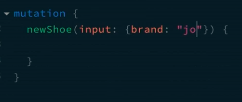

# Introduction

GraphQL - what it is: control what you ask and get from an API. It is just a spec.

Server-side:

* Type definitions (GraphQL is a strongly-typed language)
* Resolvers (aka contorollers, they retrieve data from a data source)
* Query definitions (ask)
* Mutations definitions (modify)
* Composition
* Schema (what all of the above combine)

Client-side:

* Queries (get)
* Mutations (modify)
* Fragments

Where does GraphQL fit in?
* A GraphQL server with a connected DB
* A GraphQL server as a layer in front of many 3rd party services and connects them all with one GraphQL API
* A hybrid approach where a GraphQL server has a connected DB and also communicates with 3rd party services


## Tools
Servers:
* Apollo server
* GraphQL Yoga
* ...

Services: 
* Amplify
* ...

Tools:
* Prisma
* ...

## Schemas
This is the first thing you need to create to start a GraphQL server. We do this by using *schema defintion language (SDL)*. You can also use JS to create schemas.

Basic parts of a schema:
* Types - a construct defining a shape with fields
* Fields - keys on a Type that have a name and a value type
* Scalars - primitive value type built into GraphQL
* Query - type that defines how clients can access data
* Mutation - type that defines how clients can modify or create data

## First example

When making a schema, you must define types. Types are usually wrapped in a GraphQL tag that has types, some of which are data types, and there is always a query type that must be named 'Query'. An exclamation mark next to a value means that the value must not be null.

Example code:
```js
// Create a schema
const gql = require('graphql-tag');
const { ApolloServer } = require('apollo-server');
const typeDefs = gql`
  type User {
    email: String!
    avatar: String!
    friends: [User!]!
  }

  type Query {
    me: User!
  }
`;

const resolvers = {
  Query: {
    me() {
      return {
        email: 'yoda@gmail.com',
        avatar: 'http://yoda.png',
        friends: [],
      };
    },
  },
};

const server = new ApolloServer({
  typeDefs,
  resolvers,
});

server.listen(4000).then((message) => {
  console.log(`Listening on port ${message.port}`);
});
```

# Queries & Resolvers

Query type is a special type of types that exposes data; it defines fiels that can be returned to the client upon a request.

Creating queries:
1) Create a *Query* type in the schema using SDL
2) Add fields to the *Query* type
3) Create *Resolvers* that ask for the fields

**Resolvers** - functions responsible for returning values for fields that exist on *Types* in a *Schema*. Resolvers execution is dependent on the incoming client *Query*. 

* Resolvers name must match exactly the fields in type definitions.
* Resolvers must return the value type declared for the matching field
* Resolvers can be async --> can retrieve data from any source

**Schema + Resolvers = Server**
At least 1 query and 1 type in the schema...

## Query types exercise

Notes:
- Custom resolvers override native (default resolvers) that exist on type's fields
- Any resolver that is inside the Query type, it will be the top-level resolver. Any other resolver will be a bottom-level resolver

# Arguments 

```js
Query: {
    pets(_, __, context) {
      // first arg: info passed from parent query, second arg: arguments, third: context (from apollo server)
      return context.models.Pet.findMany();
    },
  },
```

In the code above `__` are the *arguments* argument. 
- Arguments must be a part of the schema.
- Can be added to any field (of any type)
- Either have to be scalar or input types


Example of arguments:
```js
const typeDefs = gql`
  type User {
    id: ID!
    username: String!
  }

  type Pet {
    id: ID!
    name: String!
    type: String!
    createdAt: String!
    img: String
  }

  type Query {
    pets(type: String!): [Pet]! // pets must accept a type in shape of a string
  }

  # type Mutation {

  # }
`;
```

### Input Types
* Just like Types, but used only for Arguments
* All field value types must be 


# Mutations

A type on a schema that defines operations clients can perform to mutate data (create, update, delete).

Creating mutations:
* Define Mutation Type on a Schema using SDL
* Add fields for Mutation type
* Add arguments for Mutation fields

The mutation type is put in the schema. Any field in the mutation type must match the function name in the Mutation resolver.

When entering a gql request for a mutation, you must include a *mutation* word in front of the gql object, as in:



# Advanced SDL

## Enums

Enum - a set of discrete values that can be used in place of Scalars. An enum field must resolve to one of the values in the Enum.

```js

const typeDefs = gql`
  
  enum Brands { // lists out all possible values for a field
    FIRST
    SECOND
    THIRD
    ...
  }

  type ShoeType {
    brand: Brands! // this field must contain (return) one of the values in the Brands enum
  }

`
```

## Interfaces

Interface - abstract type that cannot be used as a field value but instead used as foundations of explicit types. Great for when you have Types that share common fields, but differ slightly.

```js

const typeDefs = gql`
  
  interface Shoe {
    brand: String!
    type: String!
  }

  type Sneaker implements Shoe {
    //  Notice that fields still need to be repeated
    brand: String!
    type: String!
  }

`
```

Interfaces help not the programmer, but the client. Instead of writing a query for each desired field, client can request a query for an interface that contains all those fields.

Getting specific fields on an implementation from an interface:
 (imagine there is a Shoe interface, and Sneaker and Boot implement that interfaces)

```js
query {
  shoes {
    brand // interface property
    size  // interface property
    ... on Sneaker {
      sport // fields existing only on 
      __typename // gives the type name of the parent type --> Sneaker
    }

    ... on Boot {
      hasGrip
    }
  }
}
```

## Unions

Like interfaces, but without any defined common fields amongst Types. Useful when you need to access more than one disjoint Type from one Query, like a search.

```js
union Footwear = Sneaker | Boot
```

A union **must** have a resolver, just like any other type. Just need one query to get all of the types in the union. 

Union query: 
```js
{
  // no need to have common properties
  ... on UnionType {

  }

  ... on AnotherUnionType {

  }
}
```

No difference in performance, a very handy tool.

## Relationships

Thinking in graphs: your API is now a set of Nodes that know how to resolve themselves and have links to other Nodes. This allows a client to ask for Nodes and then follow those links to get related Nodes.

